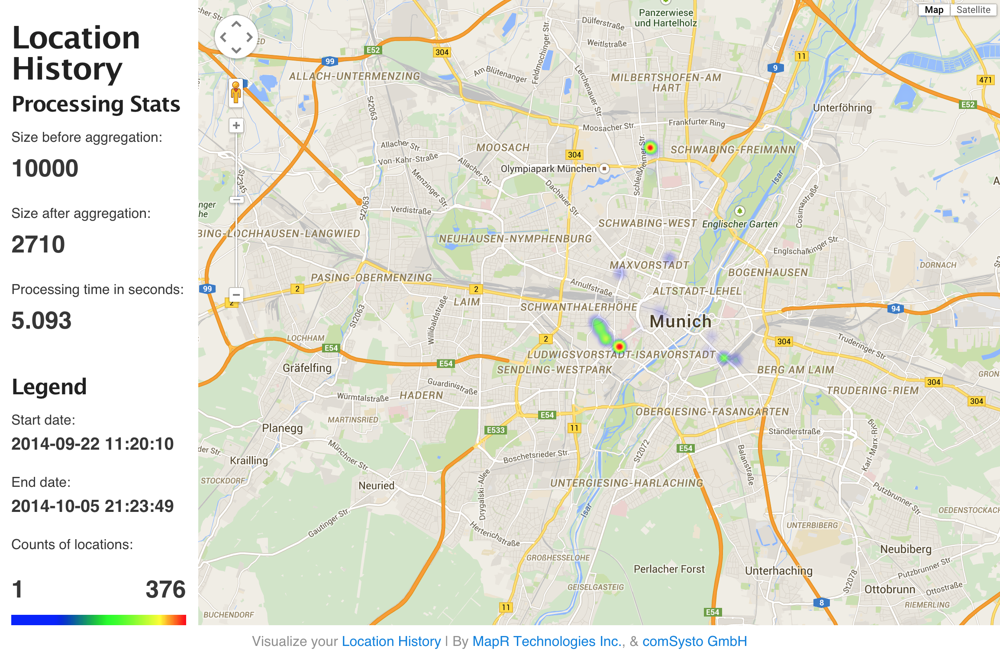
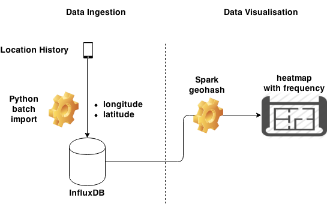
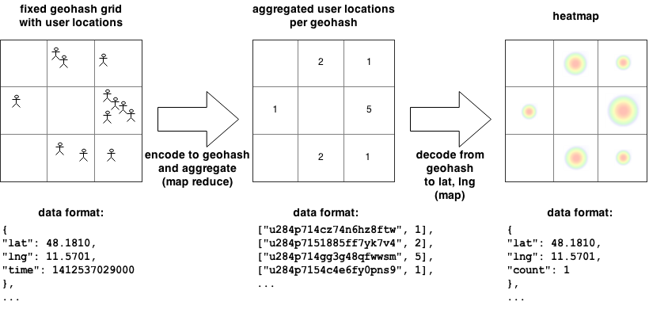

# Visualize Your Location History!

Google is storing your location history if you have an Android phone and enabled location reporting
(see https://support.google.com/gmm/answer/3118687?hl=en).

This is an application that visualizes your location history in form of a heatmap using Spark to aggregate the
(potentially huge amount of) data, e.g.:




## Get started

Here is the overview of the data flow:



In order to get started do the following:


### 1) Download your location history data
Download your location history data at https://www.google.com/settings/takeout
You can deselect everything but the Location History. Click next and wait until your location history data is ready.
When the data is downloaded, unzip it and put it in the `data/input/` directory in your checkout.


### 2) Install InfluxDB, Spark and Python packages

[Mac] Install [InfluxDB](http://influxdb.com/):

    $ brew install influxdb

[Mac] Install Spark:

    $ brew install apache-spark

Install Python (version 2.7) packages:

    $ pip install -r requirements.txt

Start InfluxDB:

    $ influxdb -config=/usr/local/etc/influxdb.conf


### 3) Import your data

Load your data into the database by running the following script:

    $ cd src/import-data
    $ python insert-data-into-influxdb.py

You can check the loaded data by opening a web browser at [http://localhost:8083/](http://localhost:8083/).
Login with the standard credentials (see [getting started guide](http://influxdb.com/docs/v0.8/introduction/getting_started.html)),
click on explore data for `location_history` and enter the following query:

    select * from locations limit 100


### 4) Process data via Spark



We use Spark as aggregator to efficiently visualize the (possibly TB large set of) collected location data. More specifically we

1. calculate a geohash value for each latitude/longitude pair for a given precision
2. count how many points fall into that geohash area

When visualizing the areas on the heatmap we need to reconvert the area geohash to latitude/longitude values as per requirement of heatmap.js.
Spark writes this aggregated data to a file in `data/output/spark_out_data.json` together with two more files containing meta data.

Run the Spark processor to count how many points fall into which areas and write the output to a file

    $ cd src/process-data
    $ spark-submit process-data.py


### 5) View the heatmap

In order to visualize your location history, i.e. how often you have been at a certain location (during an interval of time),
we construct a heatmap overlay over a google map.
The input data for the heatmap are files generated by Spark and located in `data/output/`.

Start a webserver (e.g. python SimpleHTTPServer) from the project directory root:

    $ python -m SimpleHTTPServer 1338

Now head over to your favourite browser and visit: [http://localhost:1338/src/visualize-data/](http://localhost:1338/src/visualize-data/)

#### Notes

The following dependencies are shipped with this repo:

* [heatmap.js 2.0.0](http://www.patrick-wied.at/static/heatmapjs/)
* [plugin gmaps-heatmap.js 2.0.0](http://www.patrick-wied.at/static/heatmapjs/)
* [JQuery 1.11.1](https://jquery.org/)


heatmap.js expects the following data format for its visualization:

```json
[
    {
        'lat': 24.6408,
        'lng':46.7728,
        'count': 3
    },
    {
        'lat': 24.6408,
        'lng':46.7728,
        'count': 3
    },
    ...
]
```